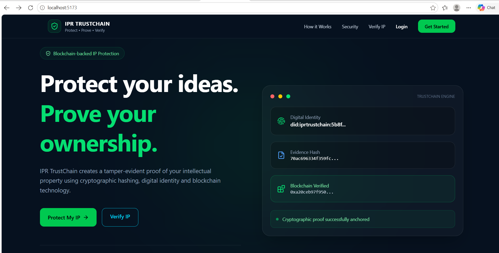
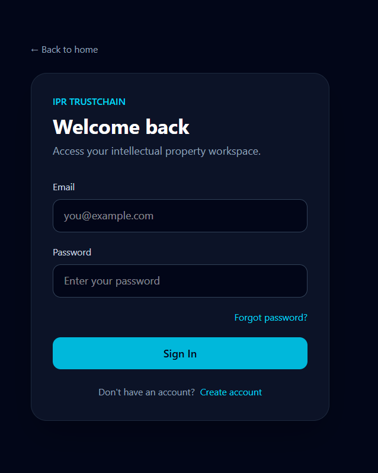
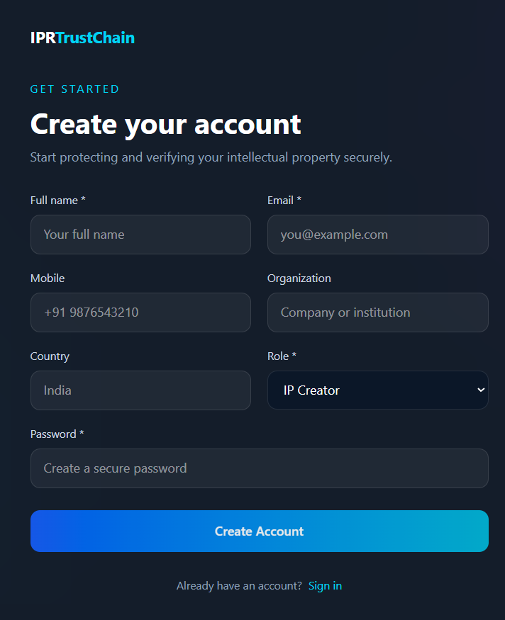
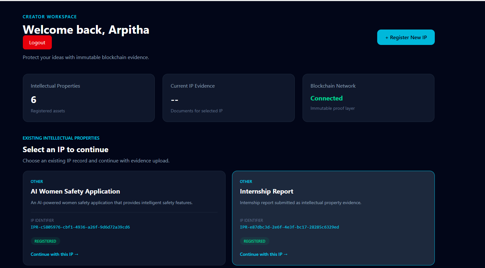
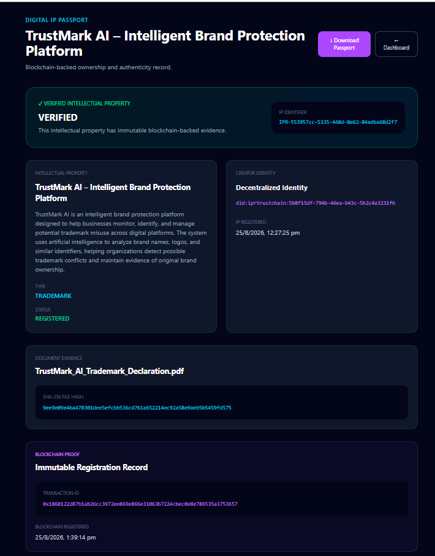
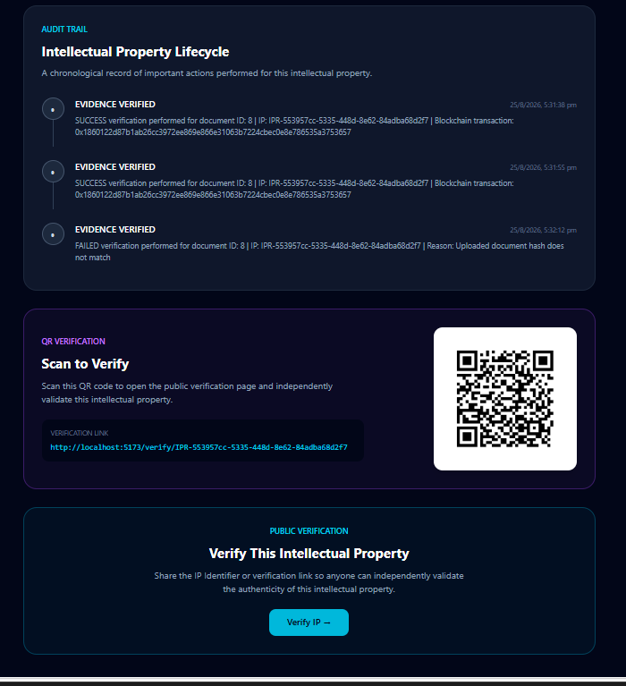
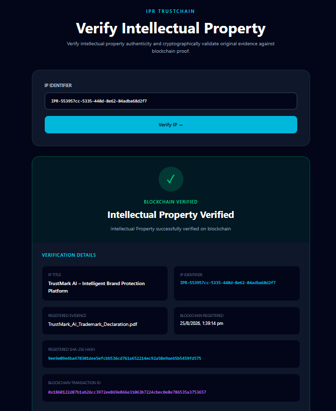
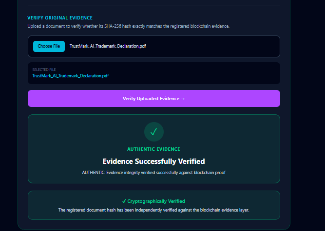
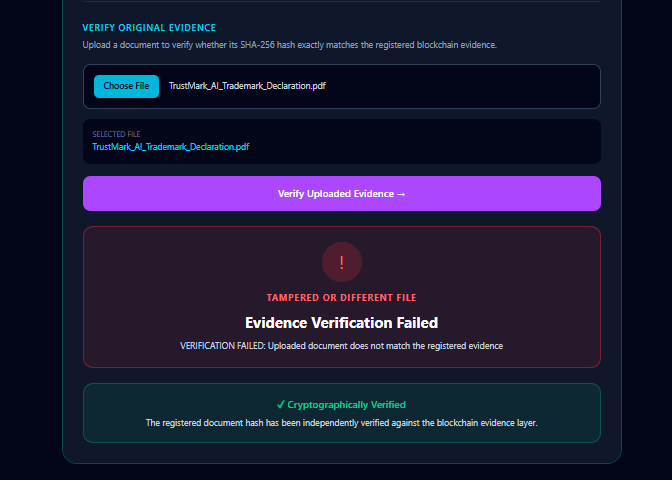
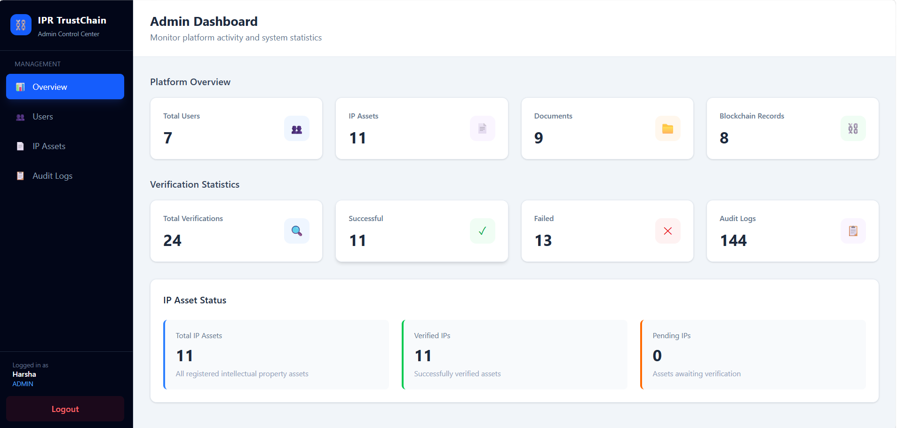

# 🔐 IPR TrustChain

### Digital Identity–Enabled Intellectual Property Protection and Verification Platform

IPR TrustChain is a full-stack, blockchain-enabled platform designed to establish and verify the provenance and integrity of Intellectual Property (IP) assets.

The platform enables creators to register IP assets, upload supporting evidence, generate cryptographic SHA-256 hashes, create blockchain-backed proof records, and allow third parties to independently verify the integrity of registered evidence.

> ⚠️ **Important:** IPR TrustChain is a digital provenance and evidence-verification platform. It does not replace government Intellectual Property registration systems and does not independently establish statutory legal ownership.

---

# 🚀 Project Objective

The objective of this MVP is to demonstrate an end-to-end Intellectual Property evidence and verification lifecycle.

```text
Creator Registration
        ↓
Digital Identity Generation
        ↓
User Authentication
        ↓
IP Asset Registration
        ↓
Unique IP Identifier Generation
        ↓
Evidence Upload
        ↓
SHA-256 Hash Generation
        ↓
Blockchain Proof Registration
        ↓
Digital IP Passport
        ↓
QR-Based Verification
        ↓
Third-Party Verification
        ↓
Authentic / Tampered Result
```

---

# ✨ Key Features

- User Registration and Authentication
- JWT-Based Security
- Role-Based Access Control
- Forgot Password and Password Reset
- Email OTP Verification
- Platform-Specific Digital Identity
- Intellectual Property Registration
- Unique IP Identifier Generation
- Evidence Document Upload
- SHA-256 Cryptographic Hashing
- Blockchain-Backed Evidence Registration
- Blockchain Transaction Tracking
- Public IP Verification
- Authentic Evidence Verification
- Tampered or Different File Detection
- Digital IP Passport
- Passport Download
- QR-Based Verification
- Audit Trail
- Admin Dashboard
- Global Exception Handling

---

# 🏗️ Architecture Overview

```text
┌─────────────────────────────┐
│          FRONTEND           │
│ React + TypeScript + Vite   │
│ Tailwind CSS                │
└──────────────┬──────────────┘
               │
               │ REST APIs / Axios
               ▼
┌─────────────────────────────┐
│           BACKEND           │
│      Spring Boot + Java     │
│   Spring Security + JWT     │
└──────────────┬──────────────┘
               │
       ┌───────┼────────┐
       ▼       ▼        ▼
┌──────────┐ ┌──────────────┐ ┌──────────────┐
│PostgreSQL│ │  Blockchain  │ │ File Storage │
│ Database │ │Smart Contract│ │   Evidence   │
└──────────┘ └──────────────┘ └──────────────┘
                    │
                    ▼
          ┌─────────────────┐
          │ Blockchain Proof│
          │ Evidence Hash   │
          │ Transaction Data│
          └─────────────────┘
```

---

# 🛠️ Tech Stack

## Frontend

- React
- TypeScript
- Vite
- Tailwind CSS
- Axios
- React Router

## Backend

- Java
- Spring Boot
- Spring Security
- JWT Authentication
- Spring Data JPA
- Hibernate
- Maven

## Database

- PostgreSQL

## Blockchain

- Solidity
- Smart Contract
- EVM-Compatible Blockchain Environment
- Cryptographic Evidence Hash Registration

## Development Tools

- Visual Studio Code
- Eclipse / Spring Tool Suite
- PostgreSQL
- npm
- Maven
- Git

---

# 📁 Project Structure

```text
IPR-TrustChain-MVP/
│
├── ipr-trustchain-frontend/
│   │
│   ├── src/
│   │   ├── api/
│   │   ├── assets/
│   │   ├── components/
│   │   ├── context/
│   │   ├── layouts/
│   │   ├── pages/
│   │   ├── types/
│   │   ├── App.tsx
│   │   └── main.tsx
│   │
│   ├── public/
│   ├── package.json
│   └── vite.config.ts
│
├── ipr-trustchain-backend/
│   │
│   ├── src/
│   │   └── main/
│   │       ├── java/
│   │       │   └── com/iprtrustchain/
│   │       │       ├── config/
│   │       │       ├── controller/
│   │       │       ├── dto/
│   │       │       ├── entity/
│   │       │       ├── enums/
│   │       │       ├── exception/
│   │       │       ├── repository/
│   │       │       ├── security/
│   │       │       └── service/
│   │       │
│   │       └── resources/
│   │           └── application.properties.example
│   │
│   └── pom.xml
│
├── ipr-trustchain-blockchain/
│   │
│   ├── contracts/
│   │   └── IPRRegistry.sol
│   │
│   ├── scripts/
│   ├── test/
│   ├── package.json
│   └── hardhat.config.ts
│
├── .gitignore
│
└── README.md
```

---

# 🔐 Authentication and Authorization

The application implements JWT-based authentication and role-based access control.

## Authentication Features

- User Registration
- User Login
- BCrypt Password Hashing
- JWT Token Generation
- JWT Authentication Filter
- Protected APIs
- Role-Based Access Control
- Forgot Password
- Email OTP Verification
- Password Reset
- Global Exception Handling

---

# 👥 Supported Roles

## 👩‍💻 CREATOR

Creators can:

- Register and authenticate
- Receive a platform-specific Digital Identity
- Create IP assets
- Upload evidence documents
- Generate evidence hashes
- Register blockchain proof
- View Digital IP Passport
- Generate QR verification
- View audit history

## 🔍 VERIFIER

Verifiers can:

- Access verification functionality
- Verify registered IP records
- Upload evidence for integrity verification
- Validate SHA-256 hashes
- Detect modified or different files

## 🛡️ ADMIN

Administrators can inspect platform data including:

- Users
- IP Assets
- Audit Logs
- Platform Activities

---

# 🪪 Digital Identity

When a creator registers, the platform generates a unique platform-specific Digital Identity.

Example:

```text
did:iprtrustchain:bf36532a-3eb3-4103-bdbb-4438308d939b
```

The Digital Identity is associated with the creator and acts as part of the IP provenance layer.

> This MVP implements a platform-specific DID and does not claim government identity verification.

---

# 📦 IP Asset Registration

Creators can register Intellectual Property assets.

Supported information includes:

- IP Title
- Description
- IP Type
- Creator Information
- Owner Information
- Creation Details
- Asset Metadata

The backend automatically generates a unique IP Identifier.

Example:

```text
IPR-493d8628-e0d4-4b02-832b-f26ab8b0f0e4
```

---

# 📄 Digital Evidence and SHA-256 Hashing

Creators can upload supporting evidence documents.

The evidence processing flow is:

```text
Document Uploaded
        ↓
SHA-256 Hash Generated
        ↓
Hash Stored
        ↓
Evidence Associated With IP Asset
        ↓
Blockchain Proof Registration
```

Example SHA-256 hash:

```text
10d081ca2f7709ddd1951e93fca70ce1f7f3c2c1a8cb3572b996683e679169b2
```

The original document is kept off-chain.

The blockchain layer stores cryptographic proof information rather than the complete document.

---

# ⛓️ Blockchain Layer

The project contains a dedicated blockchain module:

```text
ipr-trustchain-blockchain/
```

The blockchain layer provides tamper-evident proof for registered IP evidence by recording the SHA-256 hash of evidence documents on the Ethereum Sepolia test network.

The Blockchain API acts as a bridge between the Spring Boot backend and the Solidity smart contract.

## Blockchain Flow

```text
Evidence Document
        ↓
SHA-256 Hash Generated
        ↓
Spring Boot Backend
        ↓
Node.js Blockchain API
        ↓
Alchemy JSON-RPC
        ↓
Ethereum Sepolia
        ↓
IPRRegistry Smart Contract
        ↓
Hash Registered On-Chain
```

The smart contract records:

- Evidence SHA-256 Hash
- Blockchain Registration Timestamp
- Blockchain Registration Address

The blockchain transaction hash is returned from the blockchain transaction and stored by the backend for traceability.

IP metadata, Digital Identity information, and original evidence documents remain off-chain.

## Blockchain Network

- Network: Ethereum Sepolia Test Network
- RPC Provider: Alchemy
- Smart Contract: `IPRRegistry`
- Contract Address:

```text
0x99F7b8Aef8cf00B8Cb62b1E5f808bc1403ae7C1a
```

> The contract address is public blockchain information. Private keys, API keys, database credentials, and other secrets must never be committed to the repository.

---

# 📜 Smart Contract

The blockchain module contains the `IPRRegistry` Solidity smart contract.

The contract provides two primary operations:

- `registerHash()` — registers an evidence SHA-256 hash on-chain.
- `verifyHash()` — checks whether a previously registered hash exists.

Each registered hash is associated with:

- Evidence SHA-256 hash
- Blockchain timestamp
- Blockchain registration address

The smart contract stores cryptographic proof rather than the original evidence document.

The contract is deployed on the Ethereum Sepolia test network.

```solidity
struct IPRecord {
    string fileHash;
    uint256 timestamp;
    address registeredBy;
}
```

The blockchain therefore acts as a cryptographic verification layer rather than a storage location for complete IP documents.

---

# 🔍 Public IP Verification

Third parties can verify an Intellectual Property asset using its unique IP Identifier.

```text
Enter IP Identifier
        ↓
Retrieve IP Record
        ↓
Retrieve Evidence and Proof Information
        ↓
Display Verification Result
```

Example:

```text
IP Title:
EcoPulse

IP Identifier:
IPR-493d8628-e0d4-4b02-832b-f26ab8b0f0e4

Blockchain Status:
VERIFIED
```

---

# 🧪 Evidence Integrity Verification

## ✅ Authentic Evidence

```text
Original Document
        ↓
Generate SHA-256 Hash
        ↓
Compare With Registered Evidence Hash
        ↓
Hash Matches
        ↓
✓ AUTHENTIC EVIDENCE
```

Result:

```text
AUTHENTIC

Evidence integrity verified successfully against blockchain proof.
```

---

## ❌ Modified or Different Evidence

```text
Modified Document
        ↓
Generate SHA-256 Hash
        ↓
Compare With Registered Evidence Hash
        ↓
Hash Does Not Match
        ↓
✕ VERIFICATION FAILED
```

Result:

```text
TAMPERED OR DIFFERENT FILE
```

This demonstrates how even a small modification to a document produces a completely different cryptographic hash.

---

# 🛂 Digital IP Passport

Each registered IP asset can generate a Digital IP Passport.

The passport can contain:

- IP Identifier
- IP Title
- IP Type
- Description
- Creator Digital Identity
- Evidence Information
- SHA-256 Hash
- Blockchain Transaction Reference
- Registration Timestamp
- Verification Status
- Audit History
- QR Verification

Example:

```text
DIGITAL IP PASSPORT

IP:
EcoPulse

Status:
VERIFIED

Creator DID:
did:iprtrustchain:bf36532a-3eb3-4103-bdbb-4438308d939b

Evidence:
ECOPULSE.pdf
```

---

# 📱 QR-Based Verification

Each IP asset can generate a QR-based verification link.

Example:

```text
/verify/IPR-493d8628-e0d4-4b02-832b-f26ab8b0f0e4
```

The QR code enables third parties to open the verification page and independently verify the IP record.

---

# 📊 Audit Trail

The platform maintains an audit history for important lifecycle events.

Example events include:

- IP_CREATED
- DOCUMENT_UPLOADED
- BLOCKCHAIN_REGISTERED
- EVIDENCE_VERIFIED

Example lifecycle:

```text
IP CREATED
        ↓
DOCUMENT UPLOADED
        ↓
SHA-256 HASH GENERATED
        ↓
BLOCKCHAIN REGISTERED
        ↓
EVIDENCE VERIFIED
```

This provides a chronological provenance record for each Intellectual Property asset.

---

# 🗄️ Database

The backend uses PostgreSQL.

The application stores data related to:

- Users
- Digital Identities
- Intellectual Property Assets
- Documents
- Audit Logs

PostgreSQL stores application data and metadata, while the blockchain layer stores cryptographic proof information.

---

# 🔒 Security Features

The current MVP includes:

- BCrypt Password Hashing
- JWT Authentication
- Stateless Session Management
- Role-Based Access Control
- Protected APIs
- SHA-256 Evidence Hashing
- Public and Private Verification Separation
- Audit Logging
- Global Exception Handling
- Sensitive Data Separation From Blockchain Proof

---

# 🔌 API Modules

## Authentication

```text
POST /api/auth/register
POST /api/auth/login
POST /api/auth/forgot-password
POST /api/auth/reset-password
```

## Digital Identity

```text
GET  /api/identity/me
POST /api/identity/create
```

## Intellectual Property

```text
POST /api/ip
GET  /api/ip
GET  /api/ip/{assetId}
```

## Evidence Documents

```text
POST /api/documents/upload
GET  /api/documents/{id}
```

## Blockchain

Spring Boot application:

```text
POST /api/blockchain/register
GET /api/blockchain/{assetId}
```

Internal Node.js Blockchain API:

```text
POST /blockchain/register
GET  /blockchain/verify/{hash}
```

The internal Blockchain API communicates with the `IPRRegistry` smart contract on Ethereum Sepolia in production.

```

## Verification

```text
GET  /api/verify/{assetId}
POST /api/verify/{assetId}/evidence
```

## QR Code

```text
GET /api/qr/{assetId}
```

## Audit Logs

```text
GET /api/audit-logs/{assetId}
```

> API endpoint mappings may vary slightly depending on the controller configuration.

---

# ▶️ Running the Project

## Prerequisites

Install:

- Java 17 or the Java version configured for this project
- Node.js and npm
- PostgreSQL
- Maven
- Git

### Development Tools Used

- **Frontend:** Visual Studio Code
- **Backend:** Eclipse 
- **Blockchain Module:** Visual Studio Code
- **Database:** PostgreSQL

 ---

# ⚠️ Important: Required Services

IPR TrustChain can be operated in two environments:

### Local Development

1. PostgreSQL Database
2. Hardhat Local Blockchain
3. Node.js Blockchain API
4. Spring Boot Backend
5. React Frontend

### Production Deployment

1. React Frontend
2. Spring Boot Backend
3. PostgreSQL Database
4. Node.js Blockchain API
5. Alchemy RPC
6. Ethereum Sepolia Network
7. Deployed `IPRRegistry` Smart Contract

> The production deployment does not require a local Hardhat blockchain node.

---

# 🗄️ Step 1: Start PostgreSQL

Create the database:

```sql
CREATE DATABASE ipr_trustchain_backend;
```

Make sure PostgreSQL is running before starting the Spring Boot backend.

---

# ⛓️ Step 2: Start the Local Blockchain Network

> This step is required only for local blockchain development. The deployed production application uses Ethereum Sepolia.

Open a terminal and navigate to the blockchain project:

```bash
cd ipr-trustchain-blockchain
```

Install dependencies:

```bash
npm install
```

Compile the Solidity smart contracts:

```bash
npx hardhat compile
```

Start the local Hardhat blockchain network:

```bash
npx hardhat node
```

The local development blockchain runs at:

```text
http://127.0.0.1:8545
```

Keep this terminal running while using the application locally.

> Do not run the Hardhat local node for the production deployment. The production Blockchain API connects to the Ethereum Sepolia network through Alchemy.

---

# 🔗 Step 3: Start the Blockchain API

Open a new terminal inside the blockchain project directory:

```bash
cd ipr-trustchain-blockchain
```

Start the Blockchain API:

```bash
npx tsx server.ts
```

The Blockchain API runs locally on:

```text
http://localhost:3001
```

Expected output:

```text
Blockchain API running on port 3001
```

The Blockchain API provides the following internal endpoints:

```text
POST /blockchain/register
GET  /blockchain/verify/{hash}
```

In local development, the Blockchain API can connect to the local Hardhat blockchain.

In production, the Blockchain API connects to the deployed `IPRRegistry` smart contract on Ethereum Sepolia through an Alchemy JSON-RPC endpoint.

> The production Blockchain API uses environment variables for the RPC URL, private key, and contract address. These credentials must never be committed to GitHub.

---

# ⚙️ Step 4: Configure and Run the Backend

Open the backend project in:

```text
Eclipse / Spring Tool Suite
```

Navigate to:

```text
ipr-trustchain-backend
```

Create:

```text
src/main/resources/application.properties
```

Configure the PostgreSQL database:

```properties
spring.datasource.url=jdbc:postgresql://localhost:5432/ipr_trustchain_backend
spring.datasource.username=YOUR_DATABASE_USERNAME
spring.datasource.password=YOUR_DATABASE_PASSWORD

spring.jpa.hibernate.ddl-auto=update
spring.jpa.show-sql=true

jwt.secret=YOUR_JWT_SECRET
jwt.expiration=86400000
```

Run the Spring Boot application using Eclipse / Spring Tool Suite or Maven:

```bash
mvn spring-boot:run
```

The backend runs on:

```text
http://localhost:8080
```

Keep the backend running.

---

# 💻 Step 5: Run the Frontend

Open the frontend project in:

```text
Visual Studio Code
```

Navigate to:

```bash
cd ipr-trustchain-frontend
```

Install dependencies:

```bash
npm install
```

Start the React application:

```bash
npm run dev
```

The frontend runs at:

```text
http://localhost:5173
```

Open the application in your browser:

```text
http://localhost:5173
```

---

# 🏗️ Local Development Architecture

```text
                         ┌──────────────────────┐
                         │   React Frontend     │
                         │ localhost:5173       │
                         └──────────┬───────────┘
                                    │
                                    │ REST API
                                    ▼
                         ┌──────────────────────┐
                         │ Spring Boot Backend  │
                         │ localhost:8080       │
                         └───────┬────────┬─────┘
                                 │        │
                                 │        │
                                 ▼        ▼
                     ┌──────────────┐  ┌─────────────────────┐
                     │ PostgreSQL   │  │ Blockchain API      │
                     │ Database     │  │ localhost:3001      │
                     └──────────────┘  └──────────┬──────────┘
                                                  │
                                                  ▼
                                      ┌─────────────────────┐
                                      │ Hardhat Blockchain  │
                                      │ 127.0.0.1:8545      │
                                      └──────────┬──────────┘
                                                 │
                                                 ▼
                                      ┌─────────────────────┐
                                      │ Solidity Smart      │
                                      │ Contract            │
                                      │ IPRRegistry         │
                                      └─────────────────────┘
```

---

# 🔄 Complete Startup Order

## Local Development

For local development, start the services in the following order:

```text
1. PostgreSQL
        ↓
2. Hardhat Local Blockchain
   npx hardhat node
        ↓
3. Blockchain API
   npx tsx server.ts
        ↓
4. Spring Boot Backend
   mvn spring-boot:run
        ↓
5. React Frontend
   npm run dev
```

## Production

The deployed application uses:

```text
React Frontend
        ↓
Spring Boot Backend
        ↓
Node.js Blockchain API
        ↓
Alchemy RPC
        ↓
Ethereum Sepolia
        ↓
IPRRegistry Smart Contract
```

The production Blockchain API does not start a local Hardhat blockchain or redeploy the smart contract during normal application startup.

---

# 🧪 MVP Demonstration

## Case 1 — Authentic Evidence Verification

```text
1. Register Creator
        ↓
2. Digital Identity Generated
        ↓
3. Login
        ↓
4. Create IP Asset
        ↓
5. Upload Original Evidence
        ↓
6. SHA-256 Hash Generated
        ↓
7. Register Blockchain Proof
        ↓
8. Generate Digital IP Passport
        ↓
9. Open Public Verification
        ↓
10. Upload Original Evidence
        ↓
✓ AUTHENTIC EVIDENCE
```

---

## Case 2 — Tampered or Different Evidence

```text
1. Use a Modified or Different Evidence File
        ↓
2. Upload the File for Verification
        ↓
3. SHA-256 Hash Generated
        ↓
4. Compare With Registered Hash
        ↓
✕ HASH DOES NOT MATCH
        ↓
✕ VERIFICATION FAILED
```

---

# 📸 Screenshots

Application screenshots can be added to a `screenshots/` directory.

Suggested structure:

```text
screenshots/
├── IPR-Admin.png
├── IPR-Audit.png
├── IPR-Authentic.png
├── IPR-IPPasport.png
├── IPR-Tampered.png
├── IPR-Verify.png
├── IPR-creator.png
├── IPR-home.png
├── IPR-login.png
└── IPR-register.png
```


## HomePage



## Login



## IP Asset Registration



## Creator DashBoard



## IPPasport



## IP Audit



## Verify



## Evidence Verification



## Evidence Tampered



## Admin Page




---

# 🎯 MVP Feature Status

| Feature | Status |
|---|---|
| User Registration | ✅ |
| Login | ✅ |
| JWT Authentication | ✅ |
| Role-Based Access Control | ✅ |
| Forgot Password | ✅ |
| Password Reset | ✅ |
| Digital Identity | ✅ |
| IP Registration | ✅ |
| Unique IP Identifier | ✅ |
| Evidence Upload | ✅ |
| SHA-256 Hashing | ✅ |
| Blockchain Proof Registration | ✅ |
| Transaction Tracking | ✅ |
| Public Verification | ✅ |
| Authentic Evidence Verification | ✅ |
| Tampered Evidence Detection | ✅ |
| Digital IP Passport | ✅ |
| Passport Download | ✅ |
| QR Verification | ✅ |
| Audit Trail | ✅ |
| Admin Dashboard | ✅ |
| Global Exception Handling | ✅ |
| PostgreSQL Integration | ✅ |

---

# 🚧 Future Enhancements

Potential future improvements include:

- W3C Verifiable Credentials
- Ownership Transfer
- Co-Ownership Support
- IP Licensing
- Smart Contract Licensing
- Royalty Management
- Multiple Evidence Versions
- Cloud Object Storage
- Email Notifications
- Advanced Admin Dashboard
- API Rate Limiting
- Docker Containerization
- CI/CD Pipeline
- Automated Unit Testing
- Integration Testing
- Improved Test Coverage

---

# ⚠️ Disclaimer

IPR TrustChain provides a digital evidence, provenance, and verification layer.

A blockchain transaction, SHA-256 hash, Digital Identity, or Digital IP Passport should not by itself be interpreted as statutory Intellectual Property registration or definitive legal ownership.

The platform is intended to complement existing Intellectual Property offices, legal processes, government systems, universities, and enterprise workflows.

---

# 👩‍💻 Author

**Arpitha C**

---

# ⭐ Project Status

**MVP Completed**

The current version demonstrates a complete Intellectual Property evidence lifecycle, from creator registration and Digital Identity generation to evidence hashing, blockchain-backed proof registration, public verification, tamper detection, QR verification, Digital IP Passport generation, and audit tracking.

## 🚀 Deployment Status

> ✅ **IPR TrustChain is successfully deployed and accessible through a public cloud environment.**

### 🌐 Live Application

**Frontend:**  
https://ipr-trustchain-frontend.onrender.com

**Backend API:**  
https://ipr-trustchain-backend.onrender.com

**Blockchain API:**  
https://ipr-trustchain-blockchain.onrender.com

### ☁️ Deployed Services

| Component | Technology | Deployment |
|---|---|---|
| Frontend | React + TypeScript + Vite | Render |
| Backend | Spring Boot + Java | Render |
| Database | PostgreSQL | Render PostgreSQL |
| Blockchain API | Node.js + TypeScript | Render |
| Smart Contract | Solidity | Ethereum Sepolia |

### ⛓️ Blockchain Deployment

| Property | Value |
|---|---|
| Network | Ethereum Sepolia |
| RPC Provider | Alchemy |
| Smart Contract | `IPRRegistry` |
| Contract Address | `0x99F7b8Aef8cf00B8Cb62b1E5f808bc1403ae7C1a` |

```

The smart contract provides blockchain-backed cryptographic evidence registration and verification.

The blockchain stores evidence hashes and registration information, while original documents and application metadata remain off-chain.

# ☁️ Production Architecture

```text
                    ┌─────────────────────────┐
                    │    React Frontend       │
                    │   Render Deployment     │
                    └────────────┬────────────┘
                                 │
                                 │ HTTPS / REST
                                 ▼
                    ┌─────────────────────────┐
                    │   Spring Boot Backend   │
                    │   Render Deployment     │
                    │     JWT + Security      │
                    └──────────┬───────┬──────┘
                               │       │
                         ┌─────┘       └─────┐
                         ▼                   ▼
                ┌────────────────┐  ┌──────────────────┐
                │   PostgreSQL   │  │  Blockchain API  │
                │   Render DB    │  │ Node.js + TS     │
                └────────────────┘  │ Render           │
                                    └────────┬─────────┘
                                             │
                                             │ JSON-RPC
                                             ▼
                                    ┌──────────────────┐
                                    │      Alchemy     │
                                    │    RPC Provider  │
                                    └────────┬─────────┘
                                             │
                                             ▼
                                    ┌──────────────────┐
                                    │ Ethereum Sepolia │
                                    │  Test Network    │
                                    └────────┬─────────┘
                                             │
                                             ▼
                                    ┌──────────────────┐
                                    │   IPRRegistry    │
                                    │ Solidity Contract│
                                    └──────────────────┘
```

The production deployment uses Ethereum Sepolia for blockchain-backed evidence registration and verification.

The original evidence documents and application metadata remain off-chain.
